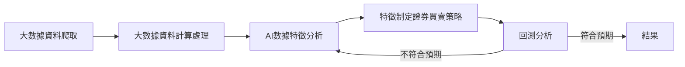

# Python_MediaPipe_Tk
Tk介面與MediaPipe
#### 流程圖

```mermaid
        graph LR
        Big_Data_Catch[大數據資料爬取] --> Calc[大數據資料計算處理]
        Calc --> Analysis[AI數據特徵分析]
        Analysis --> feature[特徵制定證券買賣策略]
        feature --> backtrader[回測分析]
        backtrader -- 符合預期 --> result[結果]
        backtrader -- 不符合預期 --> Analysis
```
