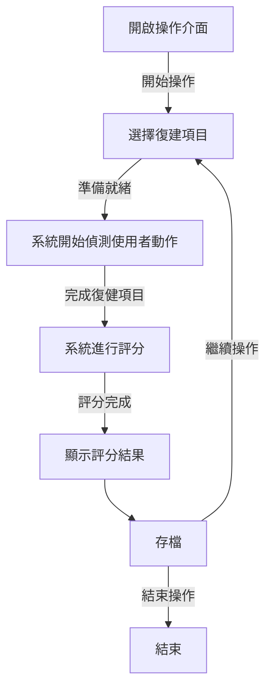
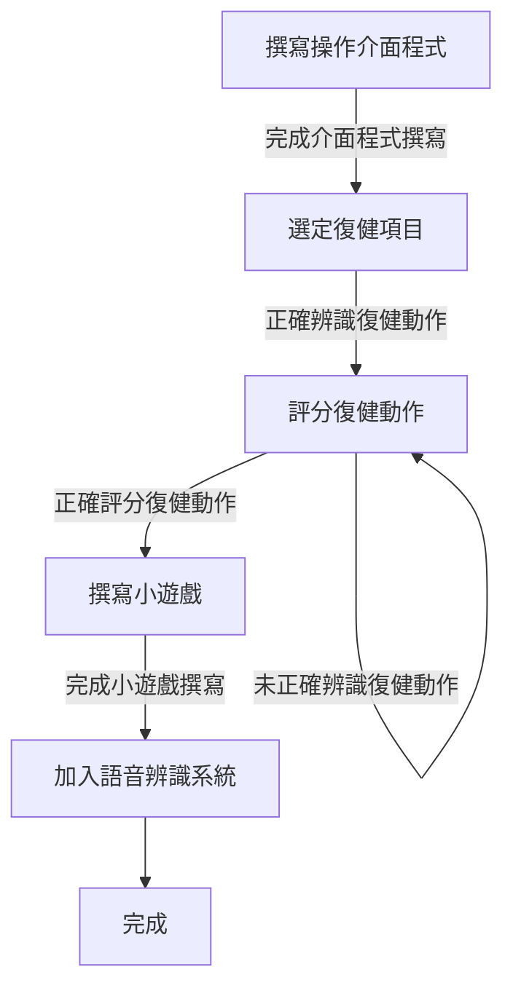

# Python_MediaPipe_Tk
Tk介面與MediaPipe
#### 流程圖

```mermaid
        graph TD
        Big_Data_Catch[開啟操作介面] -- 開始操作 --> Calc[選擇復建項目]
        Calc -- 準備就緒 --> Analysis[系統開始偵測使用者動作]
        Analysis -- 完成復健項目 --> feature[系統進行評分]
        feature -- 評分完成 --> backtrader[顯示評分結果]
        backtrader --> save[存檔]
        save -- 繼續操作 --> Calc
        save -- 結束操作 --> result[結束]
```

```mermaid
        graph TD
        Big_Data_Catch[撰寫操作介面程式] -- 完成介面程式撰寫 --> Calc[選定復健項目]
        Calc -- 正確辨識復健動作 --> Analysis[評分復健動作]
        Analysis -- 未正確辨識復健動作 --> Analysis
        Analysis -- 正確評分復健動作 --> feature[撰寫小遊戲]
        feature -- 完成小遊戲撰寫 --> backtrader[加入語音辨識系統]
        backtrader --> save[完成]
```
