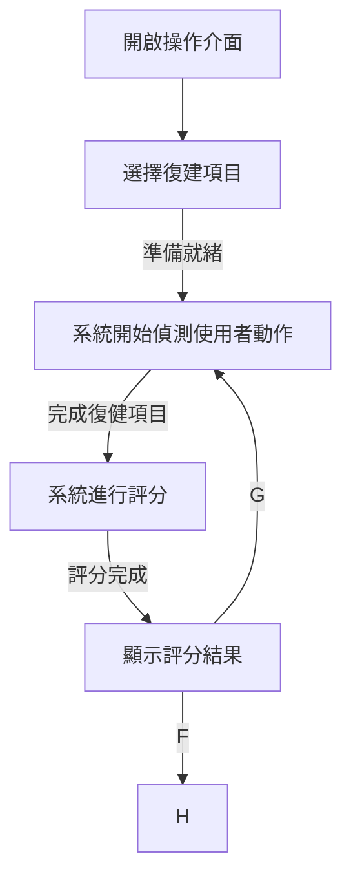

# Python_MediaPipe_Tk
Tk介面與MediaPipe
#### 流程圖

```mermaid
        graph TD
        Big_Data_Catch[開啟操作介面] --> Calc[選擇復建項目]
        Calc -- 準備就緒 --> Analysis[系統開始偵測使用者動作]
        Analysis -- 完成復健項目 --> feature[系統進行評分]
        feature -- 評分完成 --> backtrader[顯示評分結果]
        backtrader -- F --> result[H]
        backtrader -- G --> Analysis
```
